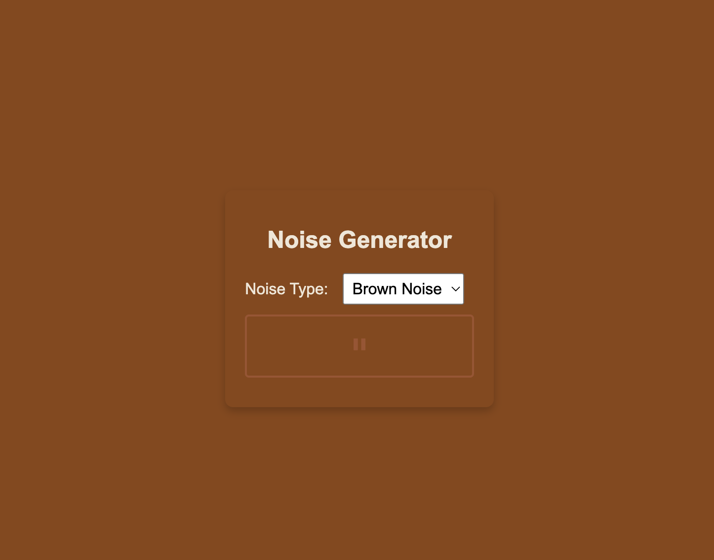
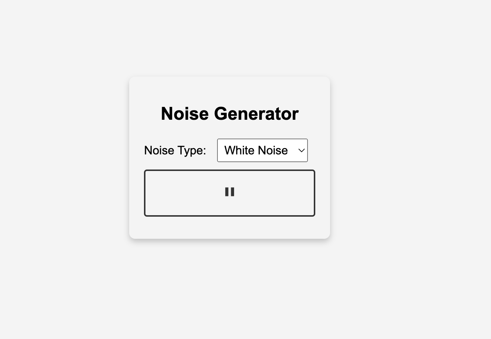
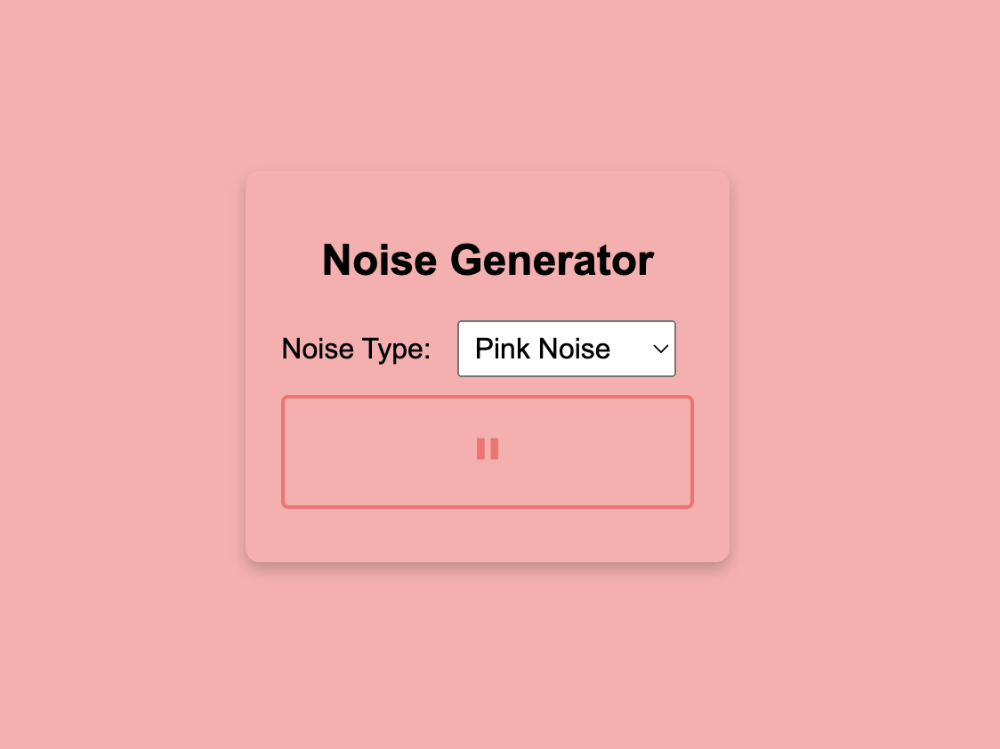

# NoisyNest: Your Ambient Noise Haven 🎧

Welcome to **NoisyNest**, the open-source ambient noise generator designed to bring a peaceful backdrop to your busy life. Whether you're working, meditating, or simply relaxing, immerse yourself in the soothing soundscapes of NoisyNest.

## Screenshots 📸

*Brown Noise Theme*

*White Noise Theme*

*Pink Noise Theme*

## Features 🎵
- **Variety of Sounds**: Choose from classic white noise, calming pink noise, or deep brown noise.
- **Interactive Design**: NoisyNest boasts a sleek and minimalist design, allowing you to change the noise type with an Apple-esque dropdown that's both beautiful and functional.
- **Adaptive UI**: With a UI that changes color based on the noise type selected, we ensure an aesthetic that matches the ambiance.
- **Auto Loop**: No need to restart or replay. Once you hit play, NoisyNest will endlessly loop the sound for continuous serenity.

## Demo 🚀
Experience the tranquillity with our live demo: [NoisyNest Live Demo](https://kuczmama.github.io/noise-generator/)

## Open Source ❤️
NoisyNest is open-source and we encourage community contributions! Feel free to fork, modify, and improve this project. We value your ideas and feedback.

## Contributing 🤝
1. Fork the repository
2. Clone your fork: `git clone https://github.com/YOUR_USERNAME/noise-generator.git`
3. Create your feature branch: `git checkout -b new-feature`
4. Commit your changes: `git commit -m 'Add new feature'`
5. Push to the branch: `git push origin new-feature`
6. Submit a pull request.

## License 📜
This project is licensed under the MIT License - see the [LICENSE.md](LICENSE.md) file for details.
